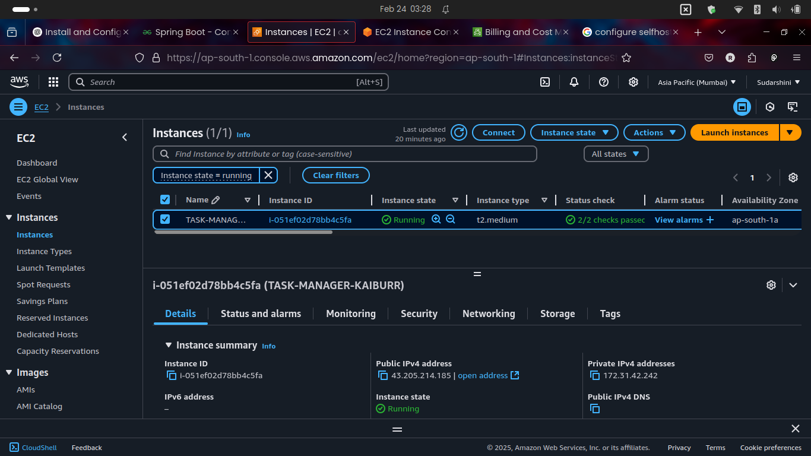
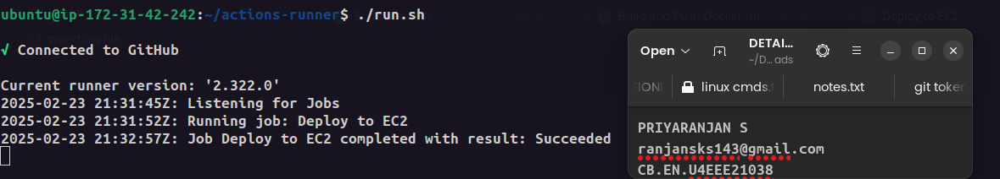
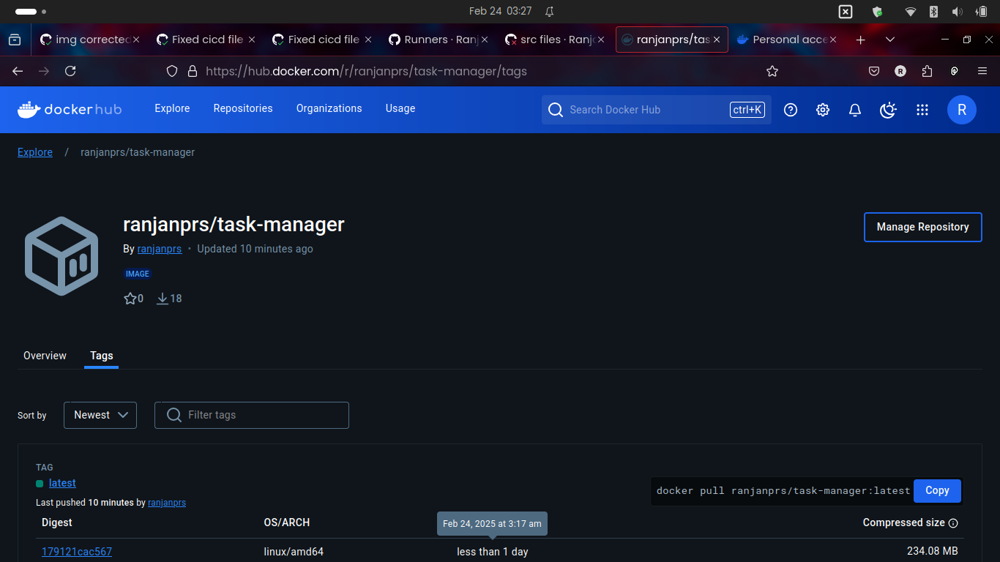
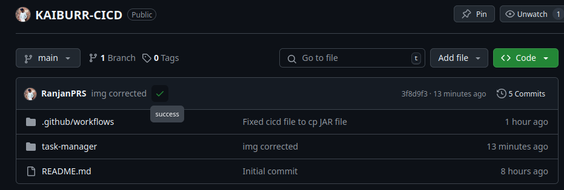
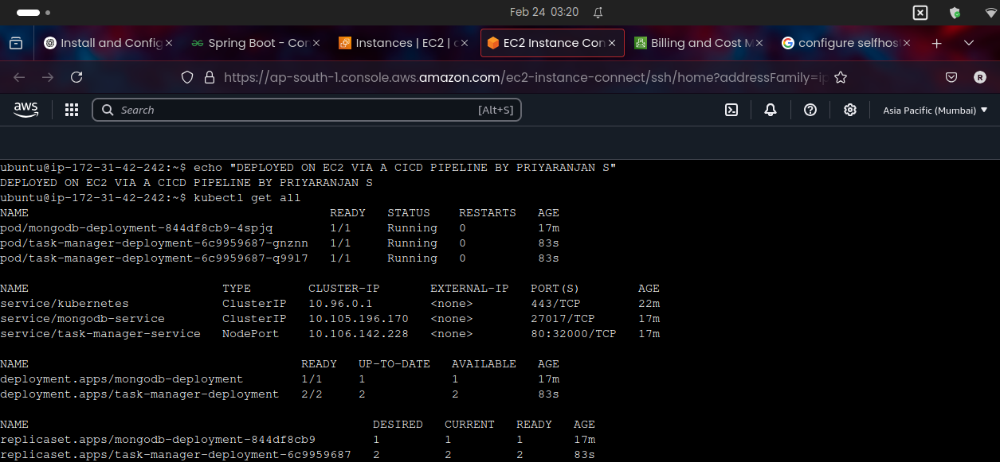

# CI/CD Pipeline for Task Manager

## Description
This project sets up a Continuous Integration and Continuous Deployment (CI/CD) pipeline using GitHub Actions for the Task Manager application built previously. The pipeline automates building, testing, and deploying a Spring Boot-based Java application to an AWS EC2 instance running a Kubernetes (Minikube) cluster. Docker is used for containerization.

## Tools Used
- **GitHub Actions** - CI/CD automation tool
- **Docker** - Containerization of the application
- **Maven** - Build Automation Tool
- **Kubernetes (Minikube)** - Deployment platform
- **AWS EC2** - Hosting environment

## Pipeline Stages
1. **Build and Test**
   - Checkout code from GitHub
   - Set up JDK 17
   - Build a JAR file using Maven
   - Run unit tests

2. **Docker Build and Push**
   - Build the Docker image
   - Push the Docker image to Docker Hub

3. **Deploy to EC2**
   - Pull the latest Docker image
   - Load the image into Minikube
   - Delete the old deployment
   - Apply Kubernetes manifests
   - Verify deployment

## Configuring a Self-Hosted Runner on AWS EC2
To deploy the application, a self-hosted runner is set up on AWS EC2:

### Steps to Set Up the Runner
1. **Launch an EC2 Instance**
   - Size: t2.medium
   - AMI: Linux Ubuntu 24.04 LTS
   - Volume Capacity: 30GB
2. **Connect to the Instance**
   ```sh
   ssh -i key.pem ubuntu@<ec2-public-ip>
   ```
3. **Install Dependencies**
   ```sh
   sudo apt update -y
   sudo apt install docker.io -y
   ```
4. **Configure GitHub Runner**
   - Download the GitHub Actions runner
   ```sh
   mkdir actions-runner && cd actions-runner
   curl -o actions-runner-linux-x64.tar.gz -L https://github.com/actions/runner/releases/download/v2.303.0/actions-runner-linux-x64.tar.gz
   tar xzf ./actions-runner-linux-x64.tar.gz
   ```
   - Register the runner
   ```sh
   ./config.sh --url https://github.com/RanjanPRS/KAIBURR-CICD --token <GitHub-personal-token>
   ```
   - Start the runner
   ```sh
   ./run.sh
   ```





## Setting Up Minikube on AWS EC2
1. **Install Minikube and kubectl**
   ```sh
   curl -LO https://storage.googleapis.com/minikube/releases/latest/minikube-linux-amd64
   sudo install minikube-linux-amd64 /usr/local/bin/minikube
   curl -LO "https://dl.k8s.io/release/$(curl -L -s https://dl.k8s.io/release/stable.txt)/bin/linux/amd64/kubectl"
   chmod +x kubectl
   sudo mv kubectl /usr/local/bin/
   ```
2. **Start Minikube**
   ```sh
   minikube start --driver=docker
   ```
3. **Verify Installation**
   ```sh
   alias k=kubectl
   k get nodes
   ```

## Docker Image
The Docker image is built and pushed to Docker Hub.

- **Docker Build Command:**
  ```sh
  docker build -t ranjanprs/task-manager:latest .
  ```
- **Docker Push Command:**
  ```sh
  docker push ranjanprs/task-manager:latest
  ```



- **Docker Hub Repository:** [Docker Hub Link](https://hub.docker.com/repository/docker/ranjanprs/task-manager/general)

## Pipeline Execution
#### Pipeline Workflow
The GitHub Actions pipeline executes automatically upon pushing changes to the `main` branch. Below are the steps involved:
1. **Build and test the application**
2. **Build the Docker image and push to Docker Hub**
3. **Deploy the application to Kubernetes on AWS EC2**




## Deployment Verification on EC2
Verify deployment on EC2 instance by connecting to it via SSH.
```sh
k get all
```



## Conclusion
> This pipeline automates the end-to-end process of building, testing, containerizing, and deploying the Task Manager application to an AWS-hosted Kubernetes cluster, ensuring a streamlined and reliable deployment process.


